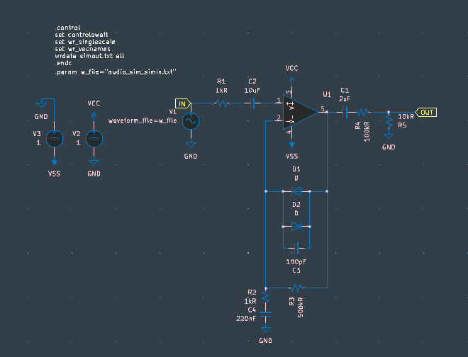
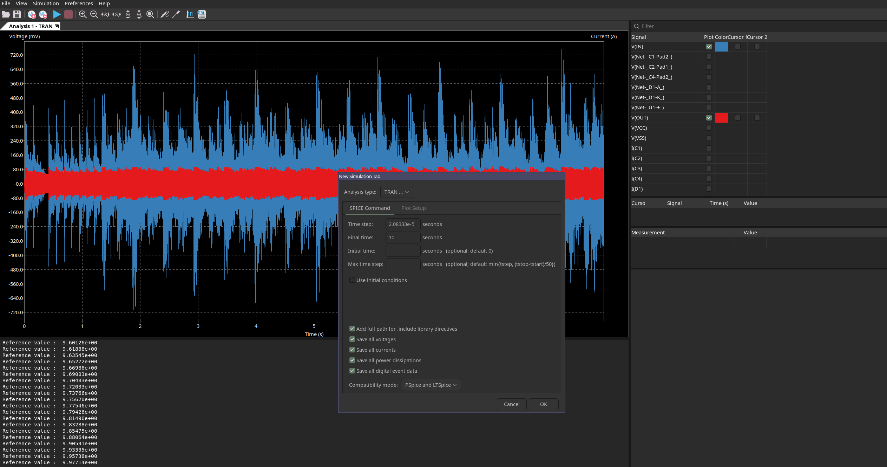

# audio_sim

simulate audio through analog circuits in kicad's spice simulator

## what is this

you know how you can simulate circuits in kicad? what if you could hear them?

this tool (`wav2pwl`) converts wav files into spice PWL (piecewise linear) format so you can feed audio into your circuit simulations. then it converts the output back to wav so you can actually listen to what your circuit does to the audio.

## building

```bash
cargo build --release
```

binaries will be in `./target/release/wav2pwl`

## workflow

### 1. convert your input audio to PWL format

```bash
./target/release/wav2pwl wav2pwl --input input.wav --output audio_sim_simin.txt
```

this creates a text file with time/voltage pairs that spice can read

options:
- `--voltage-scale` - scale the output voltage (default: 1.0V peak)
- `--decimate N` - output every Nth sample to reduce file size

### 2. set up your kicad schematic

use the example given please. just copy and paste or work directly from this.

<p align="center">
  
</p>

### 3. configure transient analysis

1. click the "Inspect" menu → "Simulator"
2. click "File" → "New Analysis Tab..." → "Transient"
3. set your time parameters:
   - **stop time**: match your audio duration (check the last timestamp in your PWL file)
   - **step time**: `1/sample_rate` (e.g., for 44.1kHz audio use ~22.7μs or smaller)

<p align="center">
  
</p>

4. add a probe to the output node you want to capture
5. click "Run Simulation"

### 4. convert back to wav

in one terminal, start the watcher:

```bash
./target/release/wav2pwl watch -i simout.txt -o output.wav
```

this watches for `simout.txt` and converts it to `output.wav` whenever it appears. it deletes the input file after conversion so you can export again from kicad.

### 5. listen to your circuit

```bash
ffplay -loop 0 output.wav
```

`-loop 0` means infinite loop. now you can hear your circuit in real-time as you export from kicad.

## advanced usage

### extracting specific columns

if your simulation has multiple outputs, specify which column to extract:

```bash
./target/release/wav2pwl watch -i simout.txt -o output.wav -c out
```

or by index:

```bash
./target/release/wav2pwl watch -i simout.txt -o output.wav -c 2
```

### sample rate control

```bash
./target/release/wav2pwl watch -i simout.txt -o output.wav --sample-rate 48000
```

### voltage scaling

if your circuit outputs aren't normalized:

```bash
./target/release/wav2pwl watch -i simout.txt -o output.wav --voltage-scale 5.0
```

## notes

- larger audio files = massive PWL files. use `--decimate` to reduce size
- start with short clips
